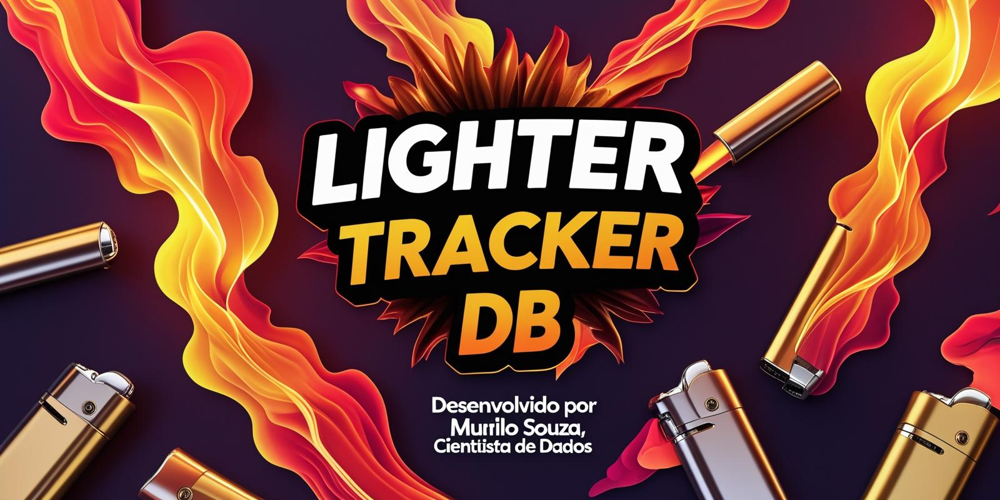
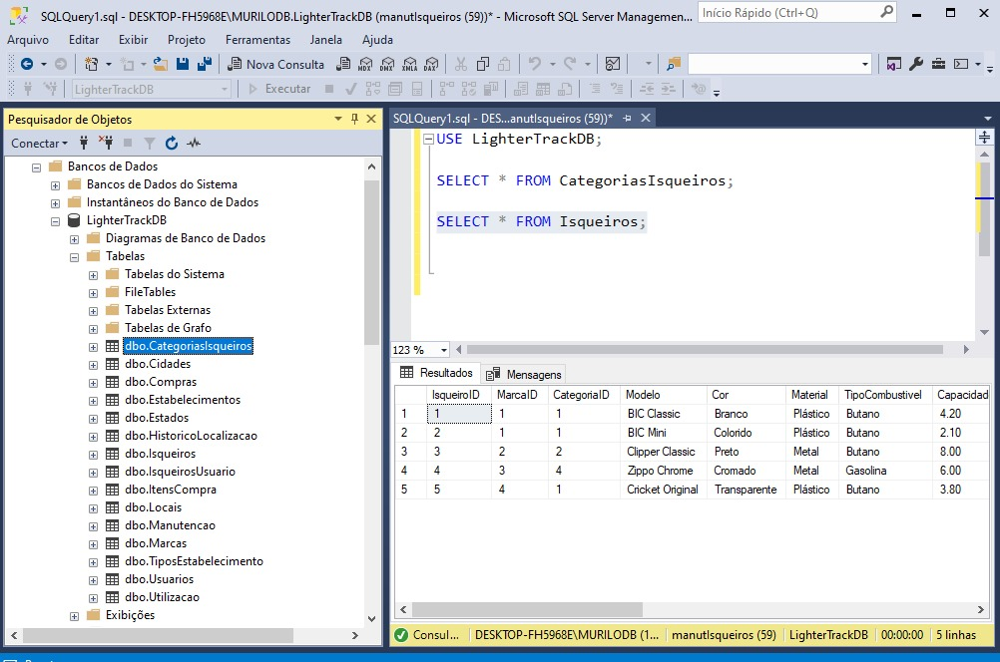

LighterTrack - Projeto Completo de Análise de Dados
===================================================




📋 Visão Geral do Projeto
-------------------------

**Objetivo:** Sistema completo de análise comportamental de consumo de isqueiros, desde modelagem de dados até aplicação de Machine Learning.

**Stack Tecnológica:**

-   **Database:** SQL Server 2019+
-   **ETL/Analysis:** Python 3.8+ (Pandas, NumPy)
-   **Machine Learning:** Scikit-Learn
-   **Visualização:** Matplotlib, Seaborn, Plotly
-   **Dashboard:** Streamlit ou Power BI
-   **Controle de Versão:** Git

🏗️ Arquitetura do Sistema
--------------------------

```
[Dados Simulados] → [SQL Server] → [Python ETL] → [Análise] → [ML] → [Dashboard]
       ↓              ↓              ↓           ↓        ↓         ↓
   CSV/Excel    Database Design   Pandas    Insights  Predição  Visualização

```

📊 Modelo de Dados (Entidades Principais)
-----------------------------------------

### **1\. USUARIOS**

-   Perfil demográfico dos consumidores
-   Padrões comportamentais
-   Histórico de compras

### **2\. ISQUEIROS**

-   Catálogo de produtos
-   Características técnicas
-   Preços e fornecedores

### **3\. COMPRAS**

-   Transações realizadas
-   Local e data da compra
-   Método de pagamento

### **4\. UTILIZACAO**

-   Padrões de uso diário
-   Locais de utilização
-   Durabilidade do produto

### **5\. LOCALIZACAO**

-   Histórico de onde foi guardado/perdido
-   Coordenadas geográficas
-   Contexto situacional

### **6\. ESTABELECIMENTOS**

-   Pontos de venda
-   Tipos de comércio
-   Localização geográfica



🎯 Regras de Negócio
--------------------

### **RN001 - Compra de Isqueiros**

-   Um usuário pode comprar múltiplos isqueiros
-   Cada compra deve ter data, local e valor
-   Isqueiros podem ser recomprados pelo mesmo usuário

### **RN002 - Utilização**

-   Cada isqueiro tem vida útil estimada
-   Uso é registrado por evento (acendimento)
-   Localização de uso é opcional mas recomendada

### **RN003 - Perda/Esquecimento**

-   Isqueiro pode ser marcado como "perdido"
-   Local da última utilização é registrado
-   Tempo entre compra e perda é calculado

### **RN004 - Reposição**

-   Sistema sugere quando comprar novo isqueiro
-   Baseado em padrões históricos do usuário
-   Considera sazonalidade e comportamento

🔧 Configurações SQL Server
---------------------------

### **Instância**

-   Nome: `LIGHTERTRACK_PROD`
-   Collation: `SQL_Latin1_General_CP1_CI_AS`
-   Authentication: Mixed Mode

### **Database**

-   Nome: `LighterTrackDB`
-   Initial Size: 100MB (Data) / 10MB (Log)
-   Growth: 10MB / 10%
-   Recovery Model: FULL

### **Segurança**

-   **Roles:** `db_lightertrack_read`, `db_lightertrack_write`
-   **Users:** `lightertrack_analyst`, `lightertrack_app`
-   **Permissions:** Principle of least privilege

### **Manutenção**

-   **Backup:** Full (diário), Diff (6h), Log (15min)
-   **Index Maintenance:** Weekly rebuild/reorganize
-   **Statistics Update:** Automated
-   **DBCC CHECKDB:** Weekly

### **Monitoramento**

-   **Alertas:** Espaço em disco, falhas de backup
-   **Jobs:** Manutenção automática
-   **Database Mail:** Notificações críticas

🐍 Pipeline Python
------------------

### **1\. Conexão e ETL**

```
# Conexão SQL Server
import pyodbc
import pandas as pd
import numpy as np

# ETL Process
def extract_data():
    # Extração dos dados do SQL Server

def transform_data():
    # Limpeza e transformação com Pandas

def load_analysis():
    # Carregamento para análise

```

### **2\. Análise Exploratória**

-   Estatísticas descritivas
-   Distribuições e padrões
-   Correlações entre variáveis
-   Identificação de outliers

### **3\. Feature Engineering**

-   Criação de variáveis derivadas
-   Encoding de variáveis categóricas
-   Normalização/Padronização
-   Seleção de features

🤖 Machine Learning
-------------------

### **Modelos Propostos**

#### **1\. Classificação - Predição de Perda**

-   **Objetivo:** Prever se usuário vai perder o isqueiro
-   **Algoritmo:** Random Forest Classifier
-   **Features:** Padrão de uso, local, perfil demográfico
-   **Métrica:** F1-Score, Precision, Recall

#### **2\. Clustering - Segmentação**

-   **Objetivo:** Agrupar usuários por comportamento
-   **Algoritmo:** K-Means
-   **Features:** Frequência de compra, locais preferidos
-   **Validação:** Silhouette Score

#### **3\. Regressão - Tempo de Reposição**

-   **Objetivo:** Prever quando comprar novo isqueiro
-   **Algoritmo:** Linear Regression / Random Forest
-   **Features:** Histórico de compras, sazonalidade
-   **Métrica:** MAE, RMSE

### **Validação dos Modelos**

-   Train/Validation/Test Split (60/20/20)
-   Cross-validation (5-fold)
-   Análise de feature importance
-   Interpretabilidade dos resultados

📈 Visualizações e Dashboard
----------------------------

### **Análises Principais**

1.  **Distribuição de Compras** por período
2.  **Heatmap de Locais** de perda
3.  **Padrões Sazonais** de consumo
4.  **Segmentação de Usuários** (clusters)
5.  **Performance dos Modelos** ML
6.  **KPIs do Negócio** (métricas chave)

### **Dashboard Interativo**

-   Filtros por período, região, perfil
-   Gráficos dinâmicos
-   Métricas em tempo real
-   Exportação de relatórios

📱 Conceito de Aplicativo
-------------------------

### **Funcionalidades**

-   **Registro de Compra:** Foto + dados do isqueiro
-   **Localização Atual:** GPS tracking
-   **Alertas:** "Você esqueceu seu isqueiro!"
-   **Estatísticas Pessoais:** Seu padrão de uso
-   **Recomendações:** Quando comprar novo

### **Mockup Screens**

1.  Tela inicial com mapa de isqueiros
2.  Cadastro de nova compra
3.  Histórico pessoal
4.  Configurações de alertas

📋 Cronograma de Execução
-------------------------

### **Semana 1-2: Database**

-   Modelagem ER
-   Scripts DDL/DML
-   Configuração SQL Server
-   Carga inicial de dados

### **Semana 3: ETL e Análise**

-   Pipeline Python
-   Análise exploratória
-   Feature engineering

### **Semana 4: Machine Learning**

-   Desenvolvimento dos modelos
-   Validação e tuning
-   Interpretação dos resultados

### **Semana 5: Visualização**

-   Dashboard interativo
-   Relatórios automatizados
-   Mockup do aplicativo

### **Semana 6: Documentação**

-   Documentação técnica
-   Posts LinkedIn
-   Apresentação final

🎯 Objetivos de Aprendizado
---------------------------

### **SQL Server (DBA Skills)**

-   ✅ Modelagem avançada de dados
-   ✅ Configuração e otimização
-   ✅ Planos de manutenção
-   ✅ Segurança e backup
-   ✅ Monitoramento e alertas

### **Python/Data Science**

-   ✅ ETL com Pandas
-   ✅ Análise exploratória
-   ✅ Feature engineering
-   ✅ Visualização de dados

### **Machine Learning**

-   ✅ Modelos supervisionados
-   ✅ Clustering (não supervisionado)
-   ✅ Validação e métricas
-   ✅ Interpretabilidade

### **Soft Skills**

-   ✅ Storytelling com dados
-   ✅ Pensamento analítico
-   ✅ Resolução de problemas
-   ✅ Comunicação técnica

📊 Métricas de Sucesso
----------------------

### **Técnicas**

-   Database performance (query time < 100ms)
-   Model accuracy (>85% para classificação)
-   Dashboard loading time (<3s)
-   Code coverage (>80%)

### **Profissionais**

-   Engajamento no LinkedIn
-   Interesse de recrutadores
-   Feedback da comunidade
-   Oportunidades geradas

🚀 Próximos Passos
------------------

1.  **Finalizar modelagem ER** com relacionamentos
2.  **Gerar scripts DDL** completos
3.  **Criar dados simulados** realistas
4.  **Configurar ambiente** SQL Server
5.  **Desenvolver pipeline** Python inicial

* * * * *

*Este projeto demonstra competências end-to-end em dados, desde arquitetura até machine learning, posicionando o profissional para roles de Analista de Dados, Cientista de Dados ou DBA.*